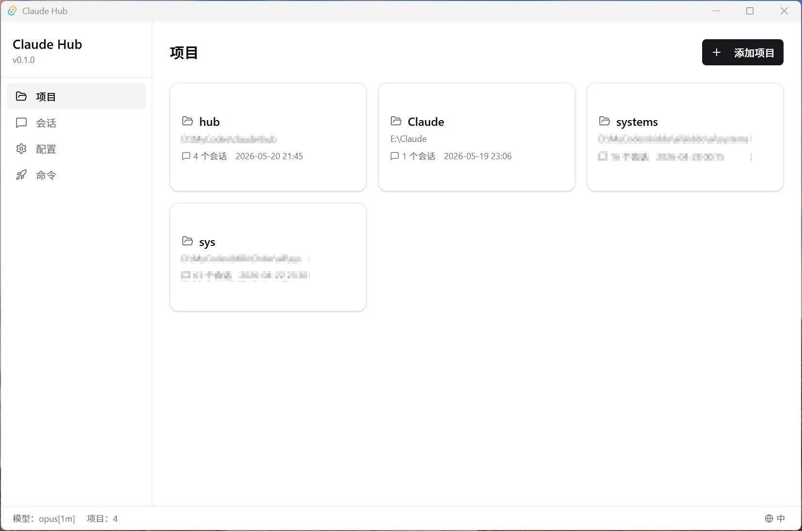
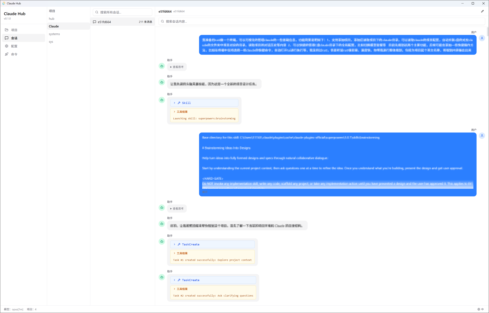
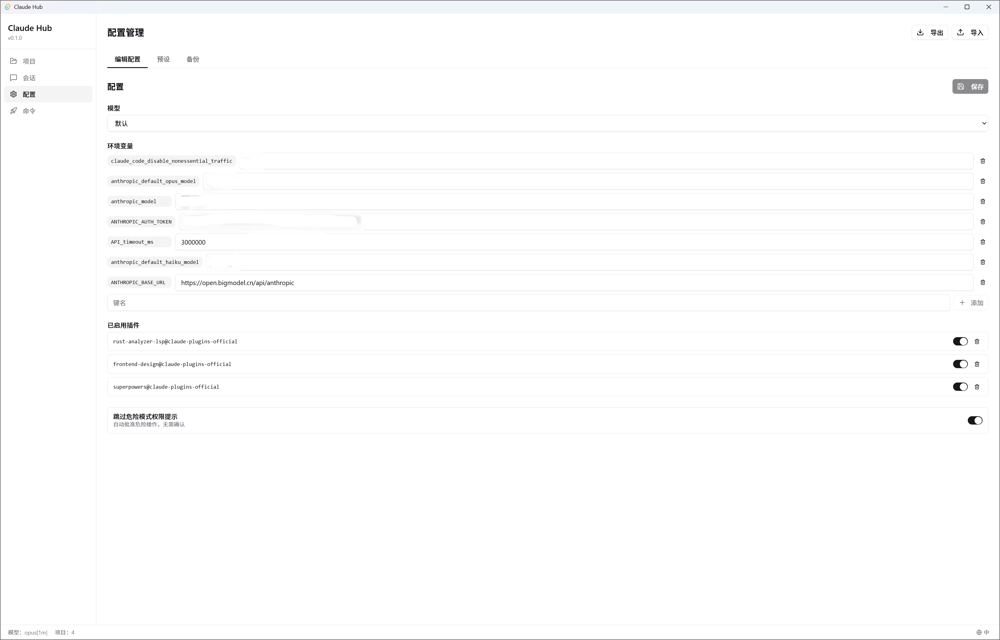

<div align="center">

# Claude Hub

**A desktop GUI for managing [Claude Code](https://docs.anthropic.com/en/docs/claude-code) projects, sessions, and configuration.**

[English](#features) | [中文文档](./README.zh-CN.md)

[](https://opensource.org/licenses/MIT)
[](https://v2.tauri.app/)
[](https://react.dev/)
[](https://www.rust-lang.org/)

[Report Bug](https://github.com/wang5766171/claude-hub/issues/new?template=bug_report.yml) · [Request Feature](https://github.com/wang5766171/claude-hub/issues/new?template=feature_request.yml) · [Discussions](https://github.com/wang5766171/claude-hub/discussions)

</div>

---

<p align="center">
  
  
</p>

<p align="center">
  
</p>

> **TL;DR** — If you use Claude Code CLI daily and want a visual way to manage projects, browse session history, and edit config without touching JSON files, this is for you.

## Why Claude Hub?

Claude Code is powerful, but managing multiple projects, digging through session logs, and editing `settings.json` by hand gets tedious. Claude Hub gives you a **point-and-click interface** for all of that:

- See all your projects at a glance
- Browse and search full conversation history
- Edit config with a proper form UI (no more JSON typos)
- Save and switch between config presets
- Automatic config backups with one-click restore

## Features

### Project Management
- Auto-discovers all projects from `~/.claude/projects/`
- Shows session count, last active time, and CLAUDE.md status
- Add/remove projects via folder picker

### Session Browser
- Filter sessions by project
- View full conversation content with syntax highlighting
- Custom session naming for easy identification

### Configuration Editor
- Visual form editor for `settings.json`
- Model selector dropdown
- Environment variables key-value editor
- Plugin toggle switches
- Export/Import config as JSON files

### Config Presets
- Save current config as a named preset
- One-click apply to switch between configs
- Manage multiple presets for different workflows

### Backup & Restore
- Auto-backup on every config save
- Browse backup history with timestamps
- One-click restore to any previous version

### Custom Commands
- Create and manage custom slash commands
- Execute commands directly from the GUI

## Tech Stack

| Layer | Technology |
|-------|-----------|
| Desktop Framework | [Tauri v2](https://v2.tauri.app/) |
| Frontend | [React 19](https://react.dev/) + [TypeScript](https://www.typescriptlang.org/) |
| UI Components | [shadcn/ui](https://ui.shadcn.com/) + [Tailwind CSS v4](https://tailwindcss.com/) |
| Backend | [Rust](https://www.rust-lang.org/) |
| Build Tools | [Vite](https://vitejs.dev/) + [Cargo](https://doc.rust-lang.org/cargo/) |
| i18n | [i18next](https://www.i18next.com/) (English & Chinese) |

## Getting Started

### Prerequisites

| Tool | Min Version | Purpose |
|------|-------------|---------|
| [Node.js](https://nodejs.org/) | 18+ | Frontend build |
| [Rust](https://rustup.rs/) | 1.77+ | Backend compile |
| [VS Build Tools 2022](https://visualstudio.microsoft.com/visual-cpp-build-tools/) | Latest | Windows C++ toolchain |

### Install (Windows)

**1. Install Rust**

Download from [rustup.rs](https://rustup.rs/) and run `rustup-init.exe`.

```bash
rustup default stable-x86_64-pc-windows-msvc
```

**2. Install Node.js**

```bash
winget install OpenJS.NodeJS.LTS
```

**3. Install Visual Studio Build Tools**

```bash
winget install Microsoft.VisualStudio.2022.BuildTools --override "--add Microsoft.VisualStudio.Workload.VCTools --includeRecommended --passive"
```

Restart your terminal after installation.

**4. Verify**

```bash
rustc --version && node --version && npm --version
```

### Build & Run

```bash
# Install dependencies
npm install

# Dev mode (hot reload)
npm run tauri dev

# Production build (.exe installer)
npm run tauri build
```

Build output: `src-tauri/target/release/bundle/` (MSI + NSIS installers).

### Run Tests

```bash
cd src-tauri && cargo test
```

## Project Structure

```
src-tauri/src/
├── main.rs          # Tauri entry point
├── lib.rs           # IPC command registration
├── project.rs       # Project scanning & path encoding
├── config.rs        # Config load/save/backup/import/export
├── session.rs       # JSONL session parsing
├── history.rs       # Command history parsing
├── command.rs       # Custom command management
└── hub.rs           # ~/.claude-hub/ metadata

src/
├── App.tsx          # App entry & page routing
├── pages/           # Page components
├── components/
│   ├── layout/      # AppLayout, Sidebar, StatusBar
│   ├── projects/    # ProjectCard, ProjectDetail
│   ├── sessions/    # SessionList, SessionDetail, MessageView
│   ├── config/      # Config editor, presets, backups
│   ├── commands/    # Custom commands UI
│   └── ui/          # shadcn/ui base components
├── hooks/           # Custom React hooks
├── types/           # TypeScript type definitions
└── lib/             # Utility functions
```

## Data Locations

| Path | Description |
|------|-------------|
| `~/.claude/projects/` | Claude Code project data (read-only) |
| `~/.claude/settings.json` | Global config (read/write) |
| `~/.claude/backups/` | Config backup files |
| `~/.claude-hub/presets.json` | Custom config presets |
| `~/.claude-hub/sessions.json` | Session name mappings |

## Contributing

Contributions are welcome! Please see [CONTRIBUTING.md](./CONTRIBUTING.md) for guidelines.

1. Fork the repository
2. Create your feature branch (`git checkout -b feature/amazing-feature`)
3. Commit your changes (`git commit -m 'Add amazing feature'`)
4. Push to the branch (`git push origin feature/amazing-feature`)
5. Open a Pull Request

## License

This project is licensed under the MIT License - see the [LICENSE](LICENSE) file for details.

## Acknowledgments

- [Claude Code](https://docs.anthropic.com/en/docs/claude-code) by Anthropic
- [Tauri](https://tauri.app/) — for making desktop apps with Rust + Web
- [shadcn/ui](https://ui.shadcn.com/) — beautiful and accessible UI components
